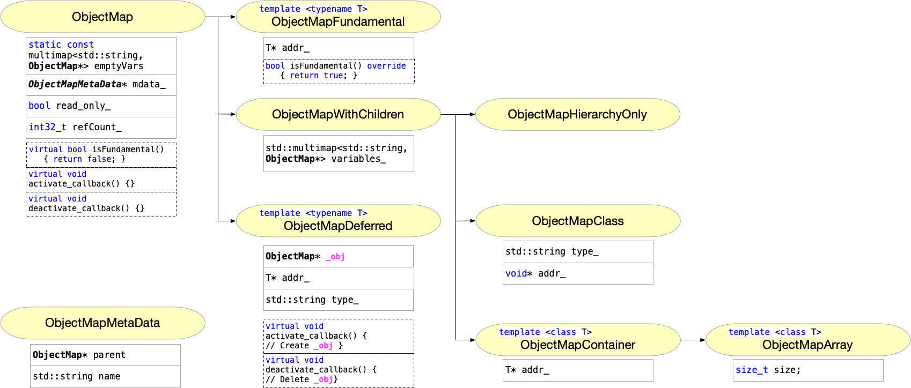
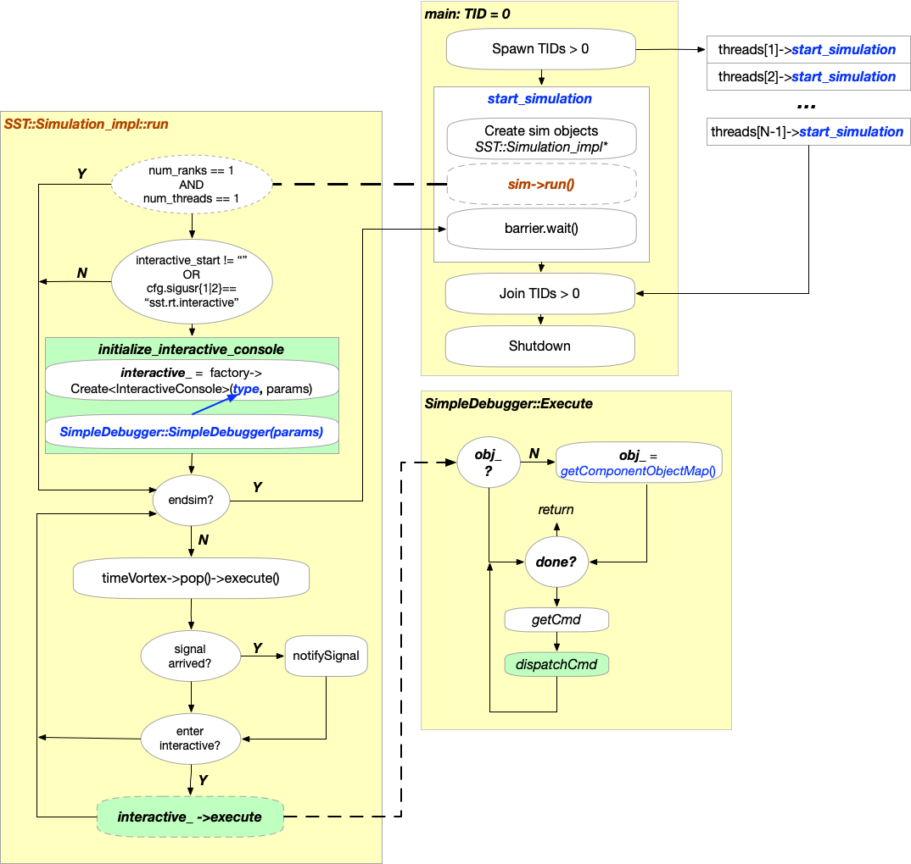
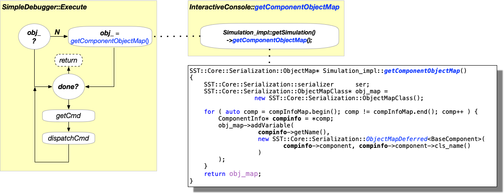
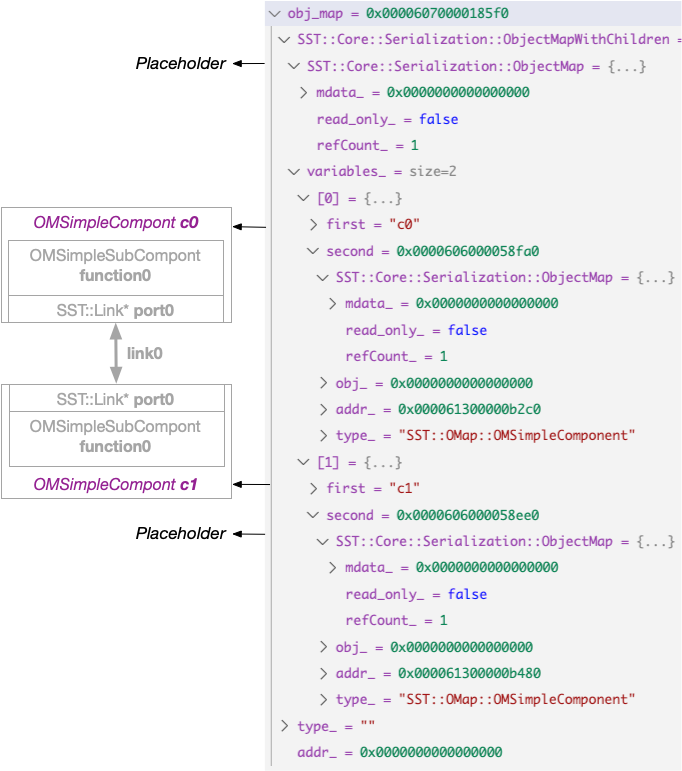
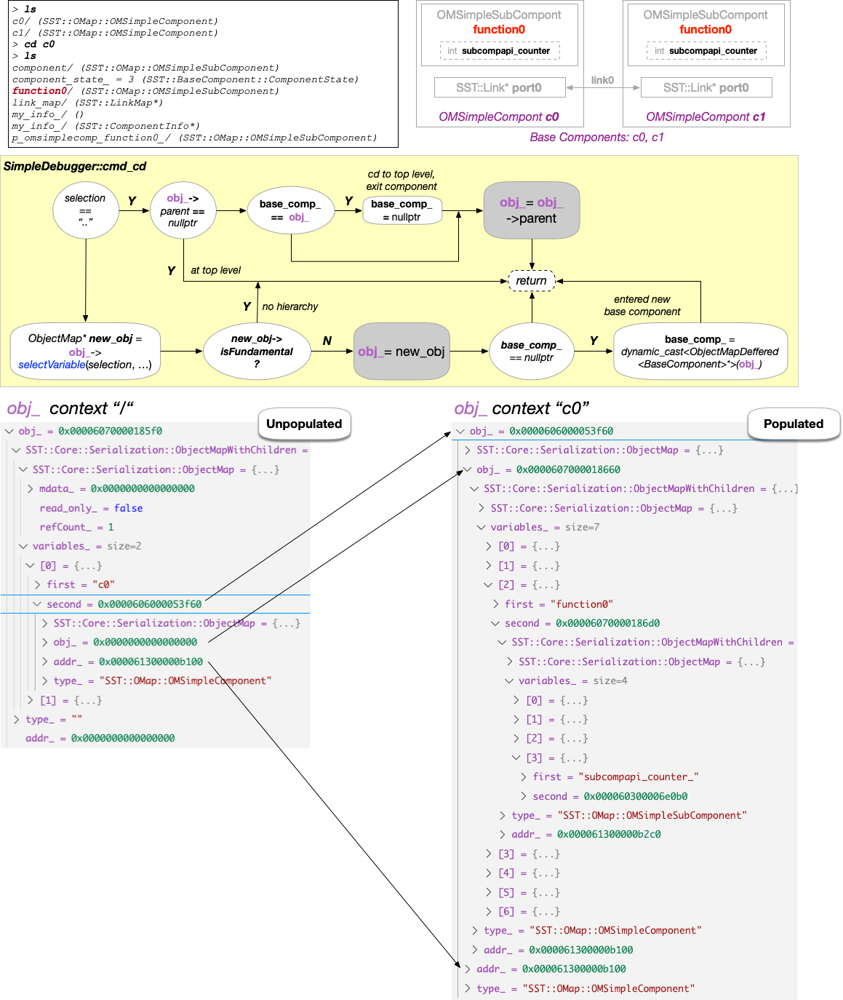
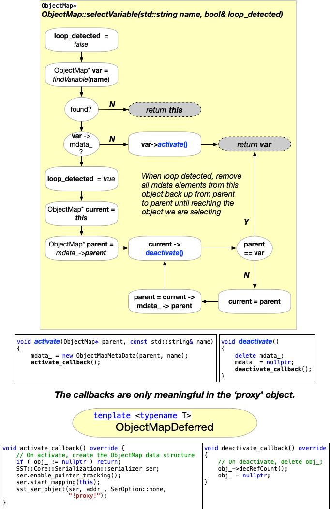

# Object Mapping
  *Theory of operation, Code Details, Examples, and Evaluation Tools*

https://github.com/tactcomplabs/sst-tools/blob/main/documentation/Object-Mapping.md

## Overview

In internal representation of internal objects, the 'Object Map',  is provided in SST primarily to 
enable a general purpose debugger. The intent of this document is two-fold:

      1. Provide SST internal developers sufficient documentation to support and extend the object map and it's usage.
      2. Provide SST users with documented examples.

As a stretch goal, utilies for evaluating object maps and creating bug reproducers may be provided.

## Getting Started

### Model Source Code

Clone the model from git hub

      git clone git@github.com:tactcomplabs/sst-tools.git
      cd sst-tools

### Building and Testing

      cd build
      git config core.hooksPath .githooks
      cmake -DSST_TOOLS_ENABLE_TESTING=ON ..
      make && make install
      ctest -j 8

---
## General Heirarchical View

TODO: Events, Statistics,... what else?
```
|-- rank_thread
    |-- component
        |-- fundamentals
        |-- containers
            |-- ...
        |-- pointers
        |-- links
        |-- subcomponent
            |-- fundamentals
            |-- containers
                |-- ...
            |-- pointers
            |-- links
```

# ObjectMap Class Hierarchy

When entering interactive mode, the object map provides a list of the top level component names using an `ObjectMapDeferred` object. When entering a component, the component's object map, complete with meta-data, is created using the recursive mapping algorithm initiated by the `activate_callback`. Similarly, when we leave a component (using `cd ..`), it's object is deleted by the `deactivate_callback`.



# ObjectMap Known Issues

## TODO: Object Mappings for SST objects
- [ ] link.cc:  link
- [ ] stabase.h: statistics

## TODO: Object Mapping for standard types
- [ ] serialize_atomic.h: std::atomic
- [ ] serialize_bitset.h:  std::bitset
- [ ] serialize_insertable.h: is_simple_set_v
- [ ] serialize_optional.h: std::optional
- [ ] serialize_shared_ptr.h: std::shared_ptr, std::weak_ptr
- [ ] serialize_unique_ptr.h: std::unique_ptr
- [ ] serialize_variant: std::variant
- [ ] serializable.h: serialize_intrusive_ptr
- [ ] sharedArray.h: shared array
- [ ] sharedMap.h: shared map
- [ ] sharedSet.h: shared set
  
TODO: Others?
  
# Single Threaded Simulation

Currently, the interactive console supports only serial, single threaded simulations as shown in the following diagram.



## The Initial Object Map

Upon entering the interactive console, the object map is an instance of `ObjectMapDeferred` which will contain the name and type of the top level components and proxies for the underlying mapped objects.



The folowing shows an example of an initial object map for a simple 2 component SDL.



# Interactive Console Usage

This section describes key commands used in navigating the model and interactions with the object maps.

## Command: list/ls

Listing the objects in the current level of hierarchy is quite simple and requires only a "pretty-print" of the variable list. Name, value, and type information is printed for fundamental types. For all other, only the name strings and types are listed.

Example:
```
> ls
c0/ (SST::OMap::OMSimpleComponent)
c1/ (SST::OMap::OMSimpleComponent)
```

Notes:
- There is no state change to the object map.
- We can currently only list the current level.

TODO: All listing of relative and absolute paths.
TODO: Support wildcards?

```
void
SimpleDebugger::cmd_ls(std::vector<std::string>& UNUSED(tokens))
{
    auto& vars = obj_->getVariables();
    for ( auto& x : vars ) {
        if ( x.second->isFundamental() ) {
            std::cout << x.first << " = " << x.second->get() 
              << " (" << x.second->getType() << ")" << std::endl;
        }
        else {
            std::cout << x.first.c_str() << "/ (" 
              << x.second->getType() << ")\n";
        }
    }
}
```

## Command: chdir/cd

Navigating the model is where the mapping functions are utilized.  Upon entering a component, the object map for that component is recursively generated and the base compoment information is saved.  When exiting a component, it's object map is deleted and the base component information is cleared.



### ObjectMap::selectVariable

`ObjectMap::selectVariable(std::string name, bool& loop_detected)`

Used in `cmd_cd` and `cmd_set`

Selecting a variable at the current working level requires verifying the variable exists. Then if it's metadata does not exist the variables object map is generated. If the metadata exists, it indicates we are in a loop which needs special handling.



TODO: example of a loop
TODO: unintended side effects of loops. Can good loops go wrong?

# Parallel Simulation

## Initial Console Entry
TODO Work out flow for top level entry into the console. We need to add rank/thread information (anything else?)

## Console Thread Communication

## Console Rank Communication

# Socket Based Console / Component Debug Probe

An alternative approach to multi-rank simulation debug involves using client/server socket communication to coalesce commands, data, and responses into a unified console