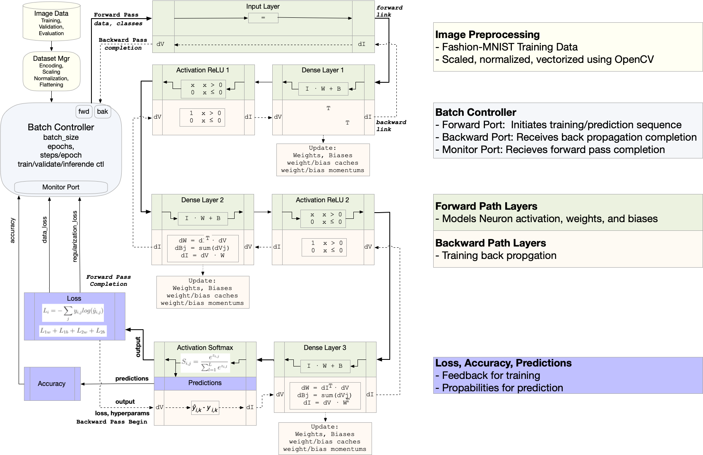

# A Neural Network in SST From Scratch
*A Case Study for SST Design and Debug*


## Overview
An SST design for a neural network is developed to demonstrate use cases for emerging SST features support checkpointing and debug.
Git branches are used to capture various stages of model development so that each step can be evaluated individually. 

## Getting Started

### Model Source Code

Clone the model from git hub

      git clone git@github.com:tactcomplabs/sst-tools.git
      cd sst-tools

### Image Data
To run tests, the image data needs to be downloaded.

      $ cd <sst-tools>/image_data
      $ ./getall.py
      $ ls fashion_mnist_images/train/* | wc -l
         60019

### Eigen Library
Eigen is a C++ template library for linear algebra: matrices, vectors, numerical solvers, and related algorithms.
For more information go to http://eigen.tuxfamily.org/ or https://libeigen.gitlab.io/docs/.

To clone and build Eigen from the source code:

      git clone https://gitlab.com/libeigen/eigen.git
      cd eigen
      mkdir -p build && cd build
      export EIGEN_HOME=$PWD
      cmake .. -DCMAKE_INSTALL_PREFIX=$EIGEN_HOME
      make install

It is available on MacOS Homebrew as well.

      brew install eigen


### OpenCV Library

Ubuntu build:

https://docs.opencv.org/4.x/d7/d9f/tutorial_linux_install.html

      git clone https://github.com/opencv/opencv.git
      cd opencv
      export OPENCV_HOME=$PWD
      git checkout 4.x
      mkdir -p build && cd build
      cmake ..
      make -j 8
      ls bin
      ls lib

It is available on MacOS Homebrew as well.

      brew install opencv


### User Environment

If not using a package manager you may need to set these environment variables in your shell setup script.

      export EIGEN_HOME=<eigen location>
      export OPENCV_HOME=<opencv location>
      export LD_LIBRARY_PATH="$LD_LIBRARY_PATH:$OPENCV_HOME/build/lib"


### Building and Testing

      cd build
      git config core.hooksPath .githooks
      cmake -DSST_TOOLS_ENABLE_TESTING=ON -DSST_TOOLS_NEURALNET=ON ..
      make && make install
      ctest -j 8

### Manual Test Example

      cd examples/debug_intro
      ./nn-basic.sh 1
   
   You should see the following predictions:

      Prediction for /Users/kgriesser/work/sst-tools/image_data/eval/tshirt.png ... Survey says ### TOP ###
      Prediction for /Users/kgriesser/work/sst-tools/image_data/eval/pants.png ... Survey says ### TROUSER ###
      Simulation is complete, simulated time: 82.2502 ms

---
<br><br><br>

# Initial Model Block Diagram

The initial model is provided in the `sst-nn-0-base` branch of the repository. This model has no special enhancements for SST debug features. It is also, essentially, a single-threaded model. Although the components can be instantiated on parallel threads their operation is serialized.



## Class Hierarchy


## Model Bring-up

The initial model was based on a reference design containing several hidden layers and training on low resolution MNIST images.  The C++ development was brought up incrementally by building and checking each object against a reference design. SST was run on a single thread using 'printf' and LLDB as the primary methods to check and debug the functionality. 

## SST SDL

The SST model structure is described in Python which provides encapsulated layers, similar to PyTorch, for easy model construction.


## Development Process

This work was inspired by _"Neural Networks from Scratch in Python", Kinsley, Kukiela, 2020_. The Python reference provides a modelling API similar to other popular AI front-ends. This was converted to a functional C++ model to establish the underlying linear algebra routines. Then, the C++ model was used as a reference to check a distributed, state machine-based implementation in SST.


## Reference code

[sst-nn-0-base](https://github.com/tactcomplabs/sst-tools/tree/sst-nn-0-base)

---
<br><br><br>

# Priming the Model for SST Serialization and Debug support

At this point, we have a complete and functional model. This seems like a convenient time to add serialization support. Additing serialization not only provides checkpointing and restart capability, but also makes internal data available to SST debug features. In this section, we'll add the necessary serialization macros and provide additional tests to ensure serialization is behaving as expected.

The official guidelines for serialization in SST are located at https://sst-simulator.org/sst-docs/docs/guides/features/checkpoint.

We will deviate slightly from the guidelines by only serializing a few variables for each class. This builds the complete infrastructure and allows some use of the debug features without having to ensure the integrity of the checkpointed simulation.

## Inherit from the Serializable Class

Since all our components inherent from SST serializable SST Core base classes we can skip this step.

## Change Clock and Event Handler Functions

The clock handler in [nn_batch_controller.cc](../sstcomp/neuralnet/nn_batch_controller.cc) is already using the required 'Handler2' type.

```
clockHandler  = new SST::Clock::Handler2<NNBatchController,&NNBatchController::clockTick>(this);
```

## Add a Default Constructor

If this easily overlooked step is missed, the model will not compile when serialization macros are added. Reviewing all the classes in the [class heirarchy](#class-hierarchy) reveals nearly all default constructors were missing. For example, in [nn_batch_controller.h](../sstcomp/neuralnet/nn_batch_controller.h) the following code was added:

```
public:
  // -------------------------------------------------------
  // Serialization support
  // -------------------------------------------------------
  // Default constructor required for serialization
  NNBatchController() : NNLayerBase() {};
};  //class NNBatchController
```

Similar code was added to all the classes.

Notice that the serialization support is put at the end of the class. This avoids potential compiler errors due to serialization macros changing the access specifier. See the (sst checkpointing guidelines) [https://sst-simulator.org/sst-docs/docs/guides/features/checkpoint] for more information.


## Add a Serialization Function

Add the business end of the serialization and deserialization feature to all serializable classes. 


The serialization support section in [nn_batch_controller.h](../sstcomp/neuralnet/nn_batch_controller.h) is now:

```
public:
  // -------------------------------------------------------
  // Serialization support
  // -------------------------------------------------------
  // Default constructor required for serialization
  NNBatchController() : NNLayerBase() {};
  // Serialization function
  void serialize_order(SST::Core::Serialization::serializer& ser) override;
};  //class NNBatchController
```

The body of the overridden function in [nn_batch_controller.cc](../sstcomp/neuralnet/nn_batch_controller.cc) is

```
void NNBatchController::serialize_order(SST::Core::Serialization::serializer &ser)
{
  NNLayerBase::serialize_order(ser);
  SST_SER(output);
}
```

The rest of the class members will be serialized later. 
Similar code can be added, tediously, to all the other classes but do not bother adding any data members. Be sure to call the base class `serialize_order` function for each instance.

At this point we just want to be sure this code compiles and runs. It is common to miss a instance of an overridden function causing confusing and repetitive runtime errors such as:

```
Error: unable to find "neuralnet" element library
SST-DL: Loading failed for /Users/kgriesser/work/sst-tools/sstcomp/neuralnet/libneuralnet.dylib, error: dlopen(/Users/kgriesser/work/sst-tools/sstcomp/neuralnet/libneuralnet.dylib, 0x0009): symbol not found in flat namespace '__ZTIN3SST9NeuralNet11NNLayerBaseE'
SST-DL: Loading failed for /Users/kgriesser/work/sst-tools/sstcomp/neuralnet/libneuralnet.dylib, error: dlopen(/Users/kgriesser/work/sst-tools/sstcomp/neuralnet/libneuralnet.dylib, 0x0009): symbol not found in flat namespace '__ZTIN3SST9NeuralNet11NNLayerBaseE'
```

If there are many classes and subclasses (as in this case), it may be better to do a few classes at a time and build and test with each change.

## Add the Appropriate Serialization Macro

`ImplementVirtualSerializable` for pure virtual classes.
`ImplementSerializable` for all others.

Our final code for the class definition of NNBatchController is now:
```
public:
  // -------------------------------------------------------
  // Serialization support
  // -------------------------------------------------------
  // Default constructor required for serialization
  NNBatchController() : NNLayerBase() {};
  // Serialization function
  void serialize_order(SST::Core::Serialization::serializer& ser) override;
  // Serialization implementation
  ImplementSerializable(SST::NeuralNet::NNBatchController)
};  //class NNBatchController
```

Note that there is no semicolon after the `ImplementSerializable` statement.

There are several pure virtual classes in this implementation.
Example: [nn_layer_base.h](../sstcomp/neuralnet/nn_layer_base.h)

```
public:
  // -------------------------------------------------------
  // Serialization support
  // -------------------------------------------------------
  // Default constructor required for serialization
  NNOptimizerAPI() : SubComponent() {}
  // Serialization function
  void serialize_order(SST::Core::Serialization::serializer& ser) override;
  // Serialization implementation
  ImplementVirtualSerializable(SST::NeuralNet::NNOptimizerAPI)
}; //class NNOptimizerAPI
```

At this point we have a partially checkpointable model (just 1 variable). The code should compile and run correctly and adding code for the rest of the variables amounts to employing the SST_SER macro judiciously.

In the next section, we'll provide more serialization and take a detour to introduce interactive debugging.

## Reference code

[sst-nn-1-ser](https://github.com/tactcomplabs/sst-tools/tree/sst-nn-1-ser)

---
<br><br><br>

# Introduction to the Interactive Debug Console

In the previous section, we built the scaffolding for serialization but did not attempt to make the model fully "checkpoint-able". That is, we cannot support restarting the simulation from a checkpoint yet. As it turns out, we're just not interested in supporting restart until we have a stable design and have scaled it up significantly.  However, serialization serves a second purpose: observability and controllability of internal state.

We will demonstrate this by first serializing the hyperparameters used by the optimizer base class and the Adam based optimizer child class.

From [nn_layer.h](../sstcomp/neuralnet/nn_layer.h)

```
void NNOptimizerAPI::serialize_order(SST::Core::Serialization::serializer &ser)
{
  SubComponent::serialize_order(ser);
  SST_SER(sstout);
  SST_SER(learning_rate_);
  SST_SER(current_learning_rate_);
  SST_SER(iterations_);
}

void NNAdamOptimizer::serialize_order(SST::Core::Serialization::serializer &ser)
{
  NNOptimizerAPI::serialize_order(ser);
  SST_SER(decay_);
  SST_SER(epsilon_);
  SST_SER(beta_1_);
  SST_SER(beta_2_);
}
```

A side benefit is that we have fully serialized these classes with a few lines of trivial code.

Now we want to observe and control the learning rate given by the following code:

```
void NNAdamOptimizer::pre_update_params() {
  if (decay_ != 0) {
    current_learning_rate_ = learning_rate_ * ( 1. / (1. + decay_ * iterations_ ));
  }
}
```

Referring back to the [top level block diagram](#initial-model-block-diagram), the loss layer feeds back loss information for back propogation. In this implementation each dense layer uses this information in its calculations to adjust weights and biases. 

With that in mind let's, enter the debug console at time 0 using the following SST command line option:
`--interactive-start=0`

The full command line
```
cd examples/debug_intro
sst nn.py --interactive-start=0 -- \
 --classImageLimit=2000 --batchSize=128 --epochs=10 \
 --hiddenLayerSize=128 --initialWeightScaling=0.01 \
 --trainingImages=../../image_data/fashion_mnist_images/train \
 --testImages=../../image_data/fashion_mnist_images/test \
 --evalImages=../../image_data/eval \
 --verbose=2
```

This results in:
```
NNBatchController[batch_controller:init:0]: init phase 0
NNBatchController[batch_controller:setup:0]: setup
Reading ../../image_data/fashion_mnist_images/train
Loaded 20000 images
Reading ../../image_data/fashion_mnist_images/test
Loaded 10000 images
Reading ../../image_data/eval
Loading image from ../../image_data/eval/tshirt.png
Loading image from ../../image_data/eval/pants.png
Loaded 2 images
NNBatchController[batch_controller:setup:0]: setup completed. Ready for first clock
Entering interactive mode at time 0 
Interactive start at 0
> 
```

Observe that the lines preceding the entry into interactive mode are sequencing through the SST `init` and `setup` phases. This illustrates a current limitation of the current SST interactive console:

*The interactive console is only available during the RUN phase of SST*
  
At the command prompt, type `help` for a list of available commands.
```
> help

--- General ---
help (?) [CMD]: show this help or detailed command help
confirm (cfm) <true/false>: set confirmation requests on (default) or off
--- Navigation ---
pwd (pwd) print the current working directory in the object map
chdir (cd) change 1 directory level in the object map
list (ls) list the objects in the current level of the object map
--- State ---
time (tm) print current simulation time in cycles
print (p) [-rN] [<obj>]: print objects at the current level
set (s) var value: set value for a variable at the current level
--- Watch/Trace ---
watch (w) <trig>: adds watchpoint to the watchlist
trace (t) <trig> : <bufSize> <postDelay> : <v1> ... <vN> : <action>
watchlist (wl) prints the current list of watchpoints
addTraceVar (add) <watchpointIndex> <var1> ... <varN>
printWatchPoint (prw) <watchpointIndex>: prints a watchpoint
printTrace (prt) <watchpointIndex>: prints trace buffer for a watchpoint
resetTrace (rst) <watchpointIndex>: reset trace buffer for a watchpoint
setHandler (shn) <idx> <t1> ... <t2>: trigger check/sampling handler
unwatch (uw) <watchpointIndex>: remove 1 or all watchpoints
--- Simulation ---
run (r) [TIME]: continues the simulation
continue (c) alias for run
exit (e) exit debugger and continue simulation
quit (q) alias for exit
shutdown (shutd) exit the debugger and cleanly shutdown simulator
--- Logging ---
logging (log) <filepath>: log command line entires to file
replay (rep) <filepath>: run commands from a file. See also: sst --replay
history (h) [N]: display all or last N unique commands

More detailed help also available for:
        addtracevar editing history print 
        printtrace printwatchpoint resettrace 
        run set sethandler trace unwatch watch 
        watchlist watchpoints 
```

See the detailed help for `history` and `editing` for information on the console "bash-like" command line interface.

```
> help history
      history [N]: list previous N instructions. If N is not set list all
            Supports bash-style commands:
            !!   execute previous command
            !n   execute command at index n
            !-n  execute commad n lines back in history
            !string  execute the most recent command starting with `string`
            ?string execute the most recent command containing `string`
            !...:p  print the instruction but not execute it.

> help editing
      editing : bash style command line editing using arrow and control keys:
            Up/Down keys: navigate command history
            Left/Right keys: navigate command string
            backspace: delete characters to the left
            tab: auto-completion
            ctrl-a: move cursor to beginning of line
            ctrl-b: move cursor to the left
            ctrl-d: delete character at cursor
            ctrl-e: move cursor to end of line
            ctrl-f: move cursor to the right
```

Now, let's just run the complete simulation to see the initial training result. Then we will re-enter the debug console to change values to affect the training behavior.
```
run
```

This results in the following (including an incorrect predication):
```
epoch 9 training:       acc: 0.773 loss: 0.600 (data_loss: 0.600 reg_loss: 0.000) lr: 0.0000389257
epoch 9 validation:     acc: 0.769 loss: 0.614
### Evaluating images
Prediction for ../../image_data/eval/tshirt.png ...     Survey says ### TOP
Prediction for ../../image_data/eval/pants.png ...      Survey says ### DRESS
```

Now, let's rerun this simulation and navigate the design:

```
sst nn.py --interactive-start=0 -- \
 --classImageLimit=2000 --batchSize=128 --epochs=10 \
 --hiddenLayerSize=128 --initialWeightScaling=0.01 \
 --trainingImages=../../image_data/fashion_mnist_images/train \
 --testImages=../../image_data/fashion_mnist_images/test \
 --evalImages=../../image_data/eval \
 --verbose=2
```

Before getting in too deep, set up logging the commands to a file so we can replay them.
```
> logging
      sst console commands will be logged to sst-console.out
```
Find the loss layer and its optimizer subcomponent.  Use the arrow and tab keys to speed up command entry. Also use '!' commands to retrieve commands from history.
```
> ls
      batch_controller/ (SST::NeuralNet::NNBatchController)
      dense1/ (SST::NeuralNet::NNLayer)
      dense2/ (SST::NeuralNet::NNLayer)
      dense3/ (SST::NeuralNet::NNLayer)
      input/ (SST::NeuralNet::NNLayer)
      loss/ (SST::NeuralNet::NNLayer)
      relu1/ (SST::NeuralNet::NNLayer)
      relu2/ (SST::NeuralNet::NNLayer)
      softmax/ (SST::NeuralNet::NNLayer)
> cd loss
> ls
      accuracy_function/ (SST::NeuralNet::NNAccuracyCategorical)
      component/ (SST::NeuralNet::NNInputLayer)
      component/ (SST::NeuralNet::NNAccuracyCategorical)
      component/ (SST::NeuralNet::NNLoss_CategoricalCrossEntropy)
      component/ (SST::NeuralNet::NNAdamOptimizer)
      component_state_ = 0 (SST::BaseComponent::ComponentState)
      link_map/ (SST::LinkMap*)
      link_map/ (SST::LinkMap*)
      link_map/ (SST::LinkMap*)
      link_map/ (SST::LinkMap*)
      loss_function/ (SST::NeuralNet::NNLoss_CategoricalCrossEntropy)
      my_info_/ ()
      my_info_/ (SST::ComponentInfo*)
      optimizer/ (SST::NeuralNet::NNAdamOptimizer)
      transfer_function/ (SST::NeuralNet::NNInputLayer)
> cd optimizer
> ls
      beta_1_ = 9.00000000000000022e-01 (double)
      beta_2_ = 9.98999999999999999e-01 (double)
      component_state_ = 0 (SST::BaseComponent::ComponentState)
      current_learning_rate_ = 1.00000000000000002e-03 (double)
      decay_ = 1.00000000000000002e-03 (double)
      epsilon_ = 9.99999999999999955e-08 (double)
      iterations_ = 0 (unsigned int)
      learning_rate_ = 1.00000000000000002e-03 (double)
      my_info_/ ()
      my_info_/ (SST::ComponentInfo)
      sstout_/ (SST::Output)
> pwd
      loss/optimizer (SST::NeuralNet::NNAdamOptimizer)
```

We can "watch" the current learning rate and the simulation will break whenever its value changes.
```
> watch current_learning_rate_ changed
      Added watchpoint #0
> wl
      Current watch points:
      0: ALL : loss/optimizer/current_learning_rate_ CHANGED  : interactive
> run
      NNBatchController[batch_controller:initTraining:1000]: Starting training phase
      NNBatchController[batch_controller:initTraining:1000]: ### Training setup
      NNBatchController[batch_controller:initTraining:1000]: epochs=10
      NNBatchController[batch_controller:initTraining:1000]: X.rows()=20000
      NNBatchController[batch_controller:initTraining:1000]: batch_size=128
      NNBatchController[batch_controller:initTraining:1000]: train_steps=157
      Entering interactive mode at time 24025000 
        WP0: AC : loss/optimizer/current_learning_rate_ ... 
> print current_learning_rate_
      current_learning_rate_ = 9.99000999000999217e-04 (double)
> r
      Entering interactive mode at time 40041000 
        WP0: AC: loss/optimizer/current_learning_rate_ ..
> !p
      current_learning_rate_ = 9.98003992015967980e-04 (double)      
```
Now we can change the learning rate and see the effects.
```
> p learning_rate_
      learning_rate_ = 1.00000000000000005e-04 (double)
> set learning_rate_  .001
> p learning_rate_
      learning_rate_ = 0.00100000000000000 (double)

> unwatch
      Do you want to delete all watchpoints? [yes, no]
> yes
Watchlist cleared
> r
...  training log omitted
epoch 9 training:       acc: 0.878 loss: 0.327 (data_loss: 0.327 reg_loss: 0.000) lr: 0.0003892565
epoch 9 validation:     acc: 0.852 loss: 0.416
### Evaluating images
Prediction for ../../image_data/eval/tshirt.png ...     Survey says ### TOP
Prediction for ../../image_data/eval/pants.png ...      Survey says ### TROUSER
Simulation is complete, simulated time: 32.2803 ms
```

We were suprisingly lucky and found a learning rate that resulted in the trained model giving an accurate prediction!
The training accuracy improved from 0.773 to 0.852 and training loss improved from 0.600 to 0.416. Similar improvements were also seen in the validation results.

If we want to repeat this, we logged all the console inputs into the file `sst-console.out`. We can copy this to `sst-console.in`, edit it, and even add comments to create a simple and repeatable script like the following:
```
$ cat sst-console.in
      # navigate to optimizer
      cd loss
      cd optimizer
      pwd

      # demonstrate watching a variable
      watch current_learning_rate_ changed
      wl
      run
      print current_learning_rate_
      r
      print current_learning_rate_

      # modify the learning rate
      p learning_rate_
      set learning_rate_  .001
      p learning_rate_

      # do not prompt to confirm clearing watchpoints
      confirm false
      unwatch
      run
```

Now to run it with `--replay=sst-console.in` to the command line. Here is the complete transcript.

```
$ sst nn.py --interactive-start=0 --replay=sst-console.in -- \
 --classImageLimit=2000 --batchSize=128 --epochs=10 \
 --hiddenLayerSize=128 --initialWeightScaling=0.01 \
 --trainingImages=../../image_data/fashion_mnist_images/train \
 --testImages=../../image_data/fashion_mnist_images/test \
 --evalImages=../../image_data/eval \
 --verbose=2

NNBatchController[batch_controller:init:0]: init phase 0
NNBatchController[batch_controller:setup:0]: setup
Reading ../../image_data/fashion_mnist_images/train
Loaded 20000 images
Reading ../../image_data/fashion_mnist_images/test
Loaded 10000 images
Reading ../../image_data/eval
Loading image from ../../image_data/eval/tshirt.png
Loading image from ../../image_data/eval/pants.png
Loaded 2 images
NNBatchController[batch_controller:setup:0]: setup completed. Ready for first clock
0 
Entering interactive mode at time 0 
Interactive start at 0
> replay sst-console.in

> # navigate to optimizer
> cd loss
> cd optimizer
> pwd
loss/optimizer (SST::NeuralNet::NNAdamOptimizer)
> 
> # demonstrate watching a variable
> watch current_learning_rate_ changed
Added watchpoint #0
> wl
Current watch points:
0: ALL : loss/optimizer/current_learning_rate_ CHANGED  : interactive
> run
NNBatchController[batch_controller:initTraining:1000]: Starting training phase
NNBatchController[batch_controller:initTraining:1000]: ### Training setup
NNBatchController[batch_controller:initTraining:1000]: epochs=10
NNBatchController[batch_controller:initTraining:1000]: X.rows()=20000
NNBatchController[batch_controller:initTraining:1000]: batch_size=128
NNBatchController[batch_controller:initTraining:1000]: train_steps=157

Entering interactive mode at time 24025000 
  WP0: AC : loss/optimizer/current_learning_rate_ ...
> print current_learning_rate_
current_learning_rate_ = 9.99000999000999136e-05 (double)
> r
 
Entering interactive mode at time 40041000 
  WP0: AC : loss/optimizer/current_learning_rate_ ...
> print current_learning_rate_
current_learning_rate_ = 9.98003992015968007e-05 (double)
> 
> # modify the learning rate
> p learning_rate_
learning_rate_ = 1.00000000000000005e-04 (double)
> set learning_rate_  .001
> p learning_rate_
learning_rate_ = 0.00100000000000000 (double)
> 
> # do not prompt to confirm clearing watchpoints
> confirm false
> unwatch
Watchlist cleared
> run
epoch 0 training:	acc: 0.653 loss: 0.935 (data_loss: 0.935 reg_loss: 0.000) lr: 0.0008650519
epoch 0 validation:	acc: 0.765 loss: 0.633
epoch 1 training:	acc: 0.799 loss: 0.539 (data_loss: 0.539 reg_loss: 0.000) lr: 0.0007616146
epoch 1 validation:	acc: 0.794 loss: 0.546
epoch 2 training:	acc: 0.828 loss: 0.468 (data_loss: 0.468 reg_loss: 0.000) lr: 0.0006802721
epoch 2 validation:	acc: 0.814 loss: 0.507
epoch 3 training:	acc: 0.845 loss: 0.427 (data_loss: 0.427 reg_loss: 0.000) lr: 0.0006146281
epoch 3 validation:	acc: 0.828 loss: 0.480
epoch 4 training:	acc: 0.854 loss: 0.400 (data_loss: 0.400 reg_loss: 0.000) lr: 0.0005605381
epoch 4 validation:	acc: 0.833 loss: 0.461
epoch 5 training:	acc: 0.862 loss: 0.380 (data_loss: 0.380 reg_loss: 0.000) lr: 0.0005151984
epoch 5 validation:	acc: 0.839 loss: 0.446
epoch 6 training:	acc: 0.867 loss: 0.364 (data_loss: 0.364 reg_loss: 0.000) lr: 0.0004766444
epoch 6 validation:	acc: 0.843 loss: 0.434
epoch 7 training:	acc: 0.871 loss: 0.350 (data_loss: 0.350 reg_loss: 0.000) lr: 0.0004434590
epoch 7 validation:	acc: 0.846 loss: 0.427
epoch 8 training:	acc: 0.875 loss: 0.338 (data_loss: 0.338 reg_loss: 0.000) lr: 0.0004145937
epoch 8 validation:	acc: 0.850 loss: 0.420
epoch 9 training:	acc: 0.878 loss: 0.327 (data_loss: 0.327 reg_loss: 0.000) lr: 0.0003892565
epoch 9 validation:	acc: 0.852 loss: 0.416
### Evaluating images
Prediction for ../../image_data/eval/tshirt.png ... 	Survey says ### TOP
Prediction for ../../image_data/eval/pants.png ... 	Survey says ### TROUSER
Simulation is complete, simulated time: 32.2803 ms
```

We can also replay files when we are in the interactive console and get identical functionality.

```
sst nn.py --interactive-start=0 -- \
 --classImageLimit=2000 --batchSize=128 --epochs=10 \
 --hiddenLayerSize=128 --initialWeightScaling=0.01 \
 --trainingImages=../../image_data/fashion_mnist_images/train \
 --testImages=../../image_data/fashion_mnist_images/test \
 --evalImages=../../image_data/eval \
 --verbose=2

> replay sst-console.in

```

Finally, by scripting the debug session, we can perform parameter sweeps. A sample script, `sweep.sh`,
is provided to demonstrate sweeping the learning rate in order to find an optimal setting. The replay file
is generated on-the-fly with a sweep parameter, LR, calculated in the surrounding loop.
```
cat > $REPLAYFILE <<EOF
# navigate to optimizer
cd loss
cd optimizer
# modify the learning rate
set learning_rate_ $LR
p learning_rate_
# do not prompt to confirm clearing watchpoints
confirm false
unwatch
run
EOF
```
Transcript:
```
$ ./sweep.sh|& tee log
### LR=0.0001 mispredict
### LR=0.0004 ACC=0.831
### LR=0.0008 ACC=0.844
### LR=0.0010 ACC=0.845
### LR=0.0015 mispredict
### LR=0.0020 mispredict
### LR=0.0025 mispredict
```

## Reference code

[sst-nn-2-dbg-intro](https://github.com/tactcomplabs/sst-tools/tree/sst-nn-2-dbgintro)


# Checkpointing A Trained Model

In this section, we want to leverage SST's checkpointing capabilities
to save a trained network and run predictions on it. The major benefit of this approach is that we do not have to write custom code to save and restore the neuron weights and biases. The tradeoff is that we need some code that works with the debug interface.

Again, we are not going to fully checkpoint the model and serialize every internal state. If we did that would end up saving the training image data which is unnecessary and would lead to enormous checkpoint files.

## Checkpoint/Restart Strategy

We need to devise a scheme where a checkpoint is generated when the 
training phase is complete. Upon restart we should be able to load the checkpoint and enter the interactive console at a "safe" state in the simulation.  Here we can update the location of the evaluation images and resume the simulation which will load the new images and run them in prediction mode.

Finally, all of this can be scripted so we can do it all in a single command line.

### Serialization the Controller State Machine

Since we are going to generate the checkpoint after training is completed,
we conveniently avoid having to serialize large matrices. This is very
good news since our matrices are using the external Eigen library which has
no built-in support for serialization.

```
void NNBatchController::serialize_order(SST::Core::Serialization::serializer &ser)
{
  NNLayerBase::serialize_order(ser);
  SST_SER(output);
  SST_SER(timeConverter);
  SST_SER(clockHandler);
  SST_SER(batch_size);
  SST_SER(epochs);
  SST_SER(print_every);
  SST_SER(evalImagesStr);
  SST_SER(testImagesStr);
  SST_SER(trainingImagesStr);
  SST_SER(dbgPauseBeforeEvaluation);
  SST_SER(dbgReloadEvaluationImages);
  SST_SER(fsmState);
  SST_SER(trainingComplete);
  SST_SER(validationComplete);
  SST_SER(evaluationComplete);
  SST_SER(epoch);
  SST_SER(step);
  SST_SER(train_steps);
  SST_SER(validation_steps);
  SST_SER(prediction_steps);
  SST_SER(linkHandlers);
  SST_SER(readyToSend);
  SST_SER(busy);
  #ifdef NN_SERIALIZE_ALL
  // Controller object containing large matrices
  // not required to save after training
  SST_SER(monitor_payload);
  SST_SER(batch_X);
  SST_SER(batch_Y);
  SST_SER(trainingImages);
  SST_SER(testImages);
  SST_SER(evalImages);
  #endif
}
```

*concern*

Serialization of functions in a base class not showing up in debugger when chdir into child class.
```
void NNLayerBase::serialize_order(SST::Core::Serialization::serializer& ser) {
  Component::serialize_order(ser);
  SST_SER(transfer_function_);
  SST_SER(loss_function_);
  SST_SER(accuracy_function_);
  SST_SER(optimizer_);
}

class NNBatchController : public NNLayerBase {...}

> pwd
batch_controller (SST::NeuralNet::NNBatchController)
> ls
component_state_ = 3 (SST::BaseComponent::ComponentState)
my_info_/ ()
my_info_/ (SST::ComponentInfo*)
output/ (SST::Output)
> 
```

## Generating a Synchronous Checkpoint

It is important to be mindful of the fact that checkpoints in parallel
simulations will only be generated at simulation 'synchronization points' 
where all threads and ranks are stopped and can exchange data. The 
implication is that if we set a `watch` on a variable that indicates 
training is complete, the `action` will occur at the next simulation 
synchronization point. If we are not careful, the simulation could
advance to an undesirable state before the checkpoint is created.

Some data members have been added to the controller class to assist
with this synchronization. These conveniently have the prefix 'dbg'. The sequence will be:

From the SST command-line:

1. checkpointing and the debug console at time 0.
   
Once in  the interactive console:

1. Navigate into the batch_controller
2. Set `dbgPauseBeforeEvaluation` to 1
3. Set `dbgReloadEvaluationImages` to 1
4. Set up a trace to create a checkpoint when `fsmState_` changes to MODE::PRECHECK_EVALUATION
5. Create another trace with the same trigger that sets `dbgPauseBeforeEvaluation` to 0.
6. Run the simulation to completion and verify the checkpoint was generated.


```
$ cd sst-tools/examples/sync_checkpoint
$ sst nn.py --interactive-start=0 --checkpoint-enable -- --classImageLimit=2000 --batchSize=128 --epochs=10 --evalImages=/Users/kgriesser/work/sst-tools/image_data/eval --hiddenLayerSize=128 --initialWeightScaling=0.01 --testImages=/Users/kgriesser/work/sst-tools/image_data/fashion_mnist_images/test --trainingImages=/Users/kgriesser/work/sst-tools/image_data/fashion_mnist_images/train --verbose=2

      NNBatchController[batch_controller:init:0]: init phase 0
      NNBatchController[batch_controller:setup:0]: setup
      Reading /Users/kgriesser/work/sst-tools/image_data/fashion_mnist_images/train
      Loaded 20000 images
      Reading /Users/kgriesser/work/sst-tools/image_data/fashion_mnist_images/test
      Loaded 10000 images
      Reading /Users/kgriesser/work/sst-tools/image_data/eval
      Loading image from /Users/kgriesser/work/sst-tools/image_data/eval/tshirt.png
      Loading image from /Users/kgriesser/work/sst-tools/image_data/eval/pants.png
      Loaded 2 images
      NNBatchController[batch_controller:setup:0]: setup completed. Ready for first clock
      0 
      Entering interactive mode at time 0 
      Interactive start at 0

      > # Enter the controller object
      > cd batch_controller/

      > # Enable pausing the simulation
      > s dbgPauseBeforeEvaluation 1

      > # Enable image reloading
      > s dbgReloadEvaluationImages 1

      > # Set up action to generate checkpoint when we enter PRECHECK_EVALUATION state
      > # enum class MODE {INVALID, TRAINING, VALIDATION, PRECHECK_EVALUATION, EVALUATION, COMPLETE};
      > trace fsmState_ changed && fsmState_ == 3 : 10 0 : fsmState_ : checkpoint
      Added watchpoint #0

      > # Also break into interactive mode in PRECHECK_EVALUATION state
      > trace fsmState_ == 3 : 10 0 : fsmState_ : interactive
      Added watchpoint #1

      > wl
      Current watch points:
      0: ALL : batch_controller/fsmState_ CHANGED batch_controller/fsmState_ == 3  : bufsize = 10 postDelay = 0 : batch_controller/fsmState_  : checkpoint
      1: ALL : batch_controller/fsmState_ == 3  : bufsize = 10 postDelay = 0 : batch_controller/fsmState_  : interactive

      > # run the simulation until we break into interactive mode
      > run
      NNBatchController[batch_controller:initTraining:1000]: Starting training phase
      NNBatchController[batch_controller:initTraining:1000]: ### Training setup
      ...
      epoch 0 training:	acc: 0.665 loss: 0.905 (data_loss: 0.905 reg_loss: 0.000) lr: 0.0008650519
      epoch 0 validation:	acc: 0.765 loss: 0.639
      ...
      epoch 9 training:	acc: 0.874 loss: 0.346 (data_loss: 0.346 reg_loss: 0.000) lr: 0.0003892565
      epoch 9 validation:	acc: 0.845 loss: 0.432
      preCheckEvaluation()
      Invoke Action
      Set Buffer Reset
      # Simulation Checkpoint: Simulated Time 32.2623 ms (Real CPU time since last checkpoint 14.40489 seconds)
      Reset Trace Buffer
      Invoke Action
      Set Buffer Reset
      Entering interactive mode at time 32262251000 
      WP1: AC : batch_controller/fsmState_ ...
      >  
```

At this point we should be able to confirm that a checkpoint has been generated.
From another window:
```
      $ ls -d checkpoint
      checkpoint_1_32262251000/
```   

We can see the checkpoint time matches the time we entered interactive debug. 

Now we can continue the simulation from the interactive console. But first we need to clear some states.

```
      > # clear the pause setting and watchlist
      > s dbgPauseBeforeEvaluation 0
      > confirm 0
      > unwatch
      Watchlist cleared
      > 
      > # finish the sim
      > run
      ### Reloading evaluation images
      Reading /Users/kgriesser/work/sst-tools/image_data/eval
      Loading image from /Users/kgriesser/work/sst-tools/image_data/eval/tshirt.png
      Loading image from /Users/kgriesser/work/sst-tools/image_data/eval/pants.png
      Loaded 2 images
      ### Evaluating images
      Prediction for /Users/kgriesser/work/sst-tools/image_data/eval/tshirt.png ... 	Survey says ### TOP
      Prediction for /Users/kgriesser/work/sst-tools/image_data/eval/pants.png ... 	Survey says ### TROUSER
      Simulation is complete, simulated time: 32.2803 ms
```

An alternative way to achieve the same result would be to use the `set var` action to clear the pause state. In this case the sequence would be:

```
cd batch_controller/
s dbgPauseBeforeEvaluation 1
s dbgReloadEvaluationImages 1

trace fsmState_ changed && fsmState_ == 3 : 10 0 : fsmState_ : checkpoint

# Clear the pause state when in PRECHECK_EVALUATION state
trace fsmState_ == 3 : 10 0 : fsmState_ : set dbgPauseBeforeEvaluation 0
wl

# finish the simulation
run
```

## Reference code

[sst-nn-3-cpt](https://github.com/tactcomplabs/sst-tools/tree/sst-nn-3-cpt)


# Running Predictions Using a Checkpointed model

## Checkpointing for a Prediction-only Model

At this point you can load the checkpoint, clear the pause state, and run. Unfortunately, it will fail quickly as we've not done a sufficient job serializing the model. Surprisingly very little code is needed to complete the serialization. 

Some representative code is shown below. The commented out serialization macros are related to training and not required to support a prediction-only network.

nn_layer.cc:
```
void NNLayer::serialize_order(SST::Core::Serialization::serializer &ser)
{
  NNLayerBase::serialize_order(ser);
  SST_SER(linkHandlers);
  // SST_SER(forwardData_i);
  // SST_SER(forwardData_o);
  // SST_SER(backwardData_i);
  // SST_SER(backwardData_o);
  // SST_SER(monitorData_o);
  SST_SER(sstout_);
  SST_SER(timeConverter_);
  SST_SER(clockHandler_);
  SST_SER(lastComponent_);
  SST_SER(driveForwardPass_);
  SST_SER(driveBackwardPass_);
  SST_SER(driveMonitor_);
}

void NNSubComponentAPI::serialize_order(SST::Core::Serialization::serializer &ser)
{
  SubComponent::serialize_order(ser);
  SST_SER(sstout_);
  // SST_SER(inputs_);
  // SST_SER(dinputs_);
  // SST_SER(util_);
}

// The Dense Layer has the weights. Since these are modeled using an external
// library they need some custom serialization code.
void NNDenseLayer::serialize_order(SST::Core::Serialization::serializer &ser)
{
  NNSubComponentAPI::serialize_order(ser);
  SST_SER(n_inputs_);
  SST_SER(n_neurons_);
  // SST_SER(initial_weight_scaling);
  // SST_SER(weight_regularizer_l1_);
  // SST_SER(weight_regularizer_l2_);
  // SST_SER(bias_regularizer_l1_);
  // SST_SER(bias_regularizer_l2_);
  // SST_SER(weight_momentums_);
  // SST_SER(weight_cache_);
  // SST_SER(bias_momentums_);
  // SST_SER(bias_cache_);
  // SST_SER(predictions_);
  // SST_SER(has_weight_cache_);
  // SST_SER(dweights_ = {};
  // SST_SER(dbiases_ = {};

  // Eigen::Matrix<> Weights and Biases need special handling

  double w, b;

  switch (ser.mode() ) {
  case SST::Core::Serialization::serializer::SIZER:
  case SST::Core::Serialization::serializer::PACK:
  {
    assert(weights_.rows() == n_inputs_);
    assert(weights_.cols() == n_neurons_);
    assert(biases_.cols() == n_neurons_);

    // get the object size during SIZER, serialize during PACK
    for (unsigned r=0; r<n_inputs_; r++) {
      for (unsigned c=0; c<n_neurons_; c++) {
        w = weights_(r,c);
        SST_SER(w);
      }
    }
    for (unsigned c=0; c<n_neurons_; c++) {
      b = biases_(c);
      SST_SER(b);
    }
    break;
  }
  case SST::Core::Serialization::serializer::UNPACK:
  {   
    // Extract from the stream and reinitialize values
    weights_.resize(n_inputs_, n_neurons_);
    for (unsigned r=0; r<n_inputs_; r++) {
      for (unsigned c=0; c<n_neurons_; c++) {
        SST_SER(w);
        weights_(r,c) = w;
      }
    }
    biases_.resize(n_neurons_);
    for (unsigned c=0; c<n_neurons_; c++) {
      SST_SER(b);
      biases_(c) = b;
    }
    break;
  }
  case SST::Core::Serialization::serializer::MAP:
  {
      // Not currently debugging weights
      break;
  }
  } //switch (ser.mode())
}

```

## Verifing Checkpoint Restart

Before starting new predictions, check that we get the same result with and without restarting from the checkpoint.

Generate the checkpoint as before. The provided script will replay the interactive console sequence for generating a checkpoint.

```
$ cd sst-tools/examples/restart
$ ./gen-checkpoint2.sh
```

Resulting in 
```
### Reloading evaluation images
Reading /Users/kgriesser/work/sst-tools/image_data/eval
Loading image from /Users/kgriesser/work/sst-tools/image_data/eval/tshirt.png
Loading image from /Users/kgriesser/work/sst-tools/image_data/eval/pants.png
Loaded 2 images
### Evaluating images
    Reset Trace Buffer
Prediction for /Users/kgriesser/work/sst-tools/image_data/eval/tshirt.png ...   Survey says ### TOP
Prediction for /Users/kgriesser/work/sst-tools/image_data/eval/pants.png ...    Survey says ### TROUSER
Simulation is complete, simulated time: 32.2803 ms
```

Now load the checkpoint and break into the interactive console:
```
$ sst nn.py --interactive-start=0 --load-checkpoint checkpoint/checkpoint_1_32262251000/checkpoint_1_32262251000.sstcpt
```

In the console:
```
> time
current time = 32262251000

> cd batch_controller/ 

> p dbgPauseBeforeEvaluation 
dbgPauseBeforeEvaluation = 1 (bool)

> p dbgReloadEvaluationImages
dbgReloadEvaluationImages = 1 (bool)

> p evalImagesStr 
evalImagesStr = /Users/kgriesser/work/sst-tools/image_data/eval (std::string)
 
> # Clear the pause state
> set dbgPauseBeforeEvaluation 0
 
> run
### Reloading evaluation images
Reading /Users/kgriesser/work/sst-tools/image_data/eval
Loading image from /Users/kgriesser/work/sst-tools/image_data/eval/tshirt.png
Loading image from /Users/kgriesser/work/sst-tools/image_data/eval/pants.png
Loaded 2 images
### Evaluating images
Prediction for /Users/kgriesser/work/sst-tools/image_data/eval/tshirt.png ...   Survey says ### TOP
Prediction for /Users/kgriesser/work/sst-tools/image_data/eval/pants.png ...    Survey says ### TROUSER
Simulation is complete, simulated time: 32.2803 ms
```

We get the same result! 

## Running New Predictions Using a Checkpointed Model

We are now ready to use our inference engine to run new predictions. All we need to do is change the path string variable to point to a different location. 

```
$ sst nn.py --interactive-start=0 --load-checkpoint checkpoint/checkpoint_1_32262251000/checkpoint_1_32262251000.sstcpt
Entering interactive mode at time 32262251000 
Interactive start at 0
```

```
> cd batch_controller/ 

> # Point to a directory with images
> set evalImagesStr /Users/kgriesser/work/sst-tools/image_data/eval2

> # Clear the pause state
> set dbgPauseBeforeEvaluation 0

> run
### Reloading evaluation images
Reading /Users/kgriesser/work/sst-tools/image_data/eval2
Loading image from /Users/kgriesser/work/sst-tools/image_data/eval2/trouser.png
Loading image from /Users/kgriesser/work/sst-tools/image_data/eval2/sandal.png
Loading image from /Users/kgriesser/work/sst-tools/image_data/eval2/shirt.png
Loading image from /Users/kgriesser/work/sst-tools/image_data/eval2/pullover.png
Loading image from /Users/kgriesser/work/sst-tools/image_data/eval2/top.png
Loading image from /Users/kgriesser/work/sst-tools/image_data/eval2/coat.png
Loading image from /Users/kgriesser/work/sst-tools/image_data/eval2/sneaker.png
Loading image from /Users/kgriesser/work/sst-tools/image_data/eval2/dress.png
Loading image from /Users/kgriesser/work/sst-tools/image_data/eval2/ankle_boot.png
Loading image from /Users/kgriesser/work/sst-tools/image_data/eval2/bag.png
Loaded 10 images
### Evaluating images
Prediction for /Users/kgriesser/work/sst-tools/image_data/eval2/trouser.png ...         Survey says ### SANDAL
Prediction for /Users/kgriesser/work/sst-tools/image_data/eval2/sandal.png ...  Survey says ### TROUSER
Prediction for /Users/kgriesser/work/sst-tools/image_data/eval2/shirt.png ...   Survey says ### SNEAKER
Prediction for /Users/kgriesser/work/sst-tools/image_data/eval2/pullover.png ...        Survey says ### SNEAKER
Prediction for /Users/kgriesser/work/sst-tools/image_data/eval2/top.png ...     Survey says ### SANDAL
Prediction for /Users/kgriesser/work/sst-tools/image_data/eval2/coat.png ...    Survey says ### BAG
Prediction for /Users/kgriesser/work/sst-tools/image_data/eval2/sneaker.png ...         Survey says ### TOP
Prediction for /Users/kgriesser/work/sst-tools/image_data/eval2/dress.png ...   Survey says ### SANDAL
Prediction for /Users/kgriesser/work/sst-tools/image_data/eval2/ankle_boot.png ...      Survey says ### TOP
Prediction for /Users/kgriesser/work/sst-tools/image_data/eval2/bag.png ...     Survey says ### TROUSER
Simulation is complete, simulated time: 32.3523 ms
```

Sadly, our network does not appear to be very well trained. However, we have now shown how checkpointing 
and the interactive debug console can be used as part of the design process.

## Reference code

[sst-nn-4-rst](https://github.com/tactcomplabs/sst-tools/tree/sst-nn-4-rst)

