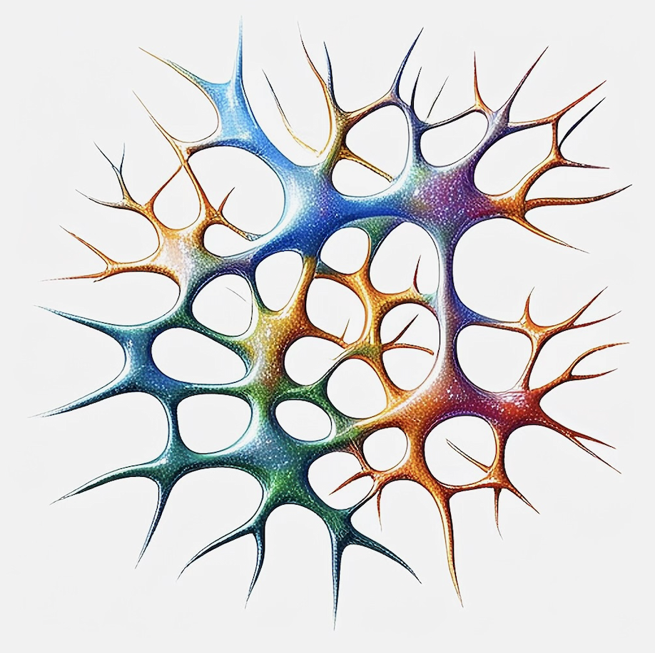
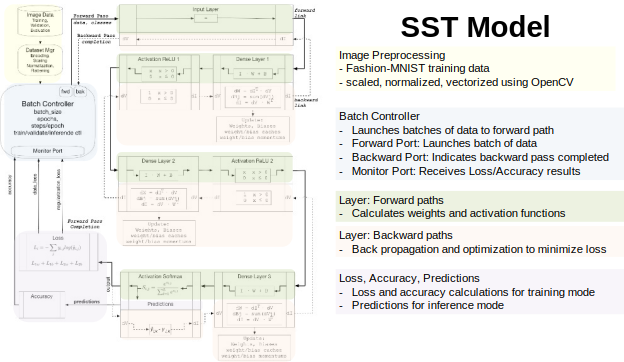
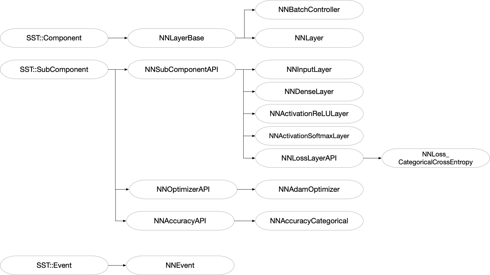
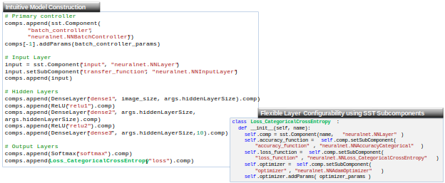
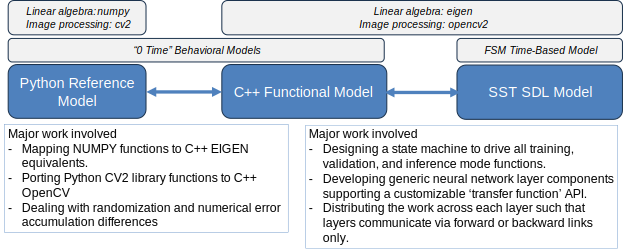

# A Neural Network in SST: A Development and Debug Case Study


## Overview
An SST design for a neural network is developed to demonstrate use cases for emerging SST features support checkpointing and debug.
Git branches are used to capture various stages of model development so that each step can be evaluated individually. 

## Getting Started

### Model Source Code

Clone the model from git hub and checkout the `sst-nn` branch

      git clone git@github.com:tactcomplabs/sst-tools.git
      cd sst-tools
      git checkout sst-nn

### Image Data
To run tests, the image data needs to be downloaded.

      $ cd <sst-tools>/image_data
      $ ./get-all.py
      $ ls fashion_mnist_images/train/* | wc -l
         60019

### Eigen Library
Eigen is a C++ template library for linear algebra: matrices, vectors, numerical solvers, and related algorithms.
For more information go to http://eigen.tuxfamily.org/ or https://libeigen.gitlab.io/docs/.

To clone and build Eigen from the source code:

      git clone https://gitlab.com/libeigen/eigen.git
      cd eigen
      mkdir -p build && cd build
      export EIGEN_HOME=$PWD
      cmake .. -DCMAKE_INSTALL_PREFIX=$EIGEN_HOME
      make install

It is available on MacOS Homebrew as well.

      brew install eigen


### OpenCV Library

Ubuntu build:

https://docs.opencv.org/4.x/d7/d9f/tutorial_linux_install.html

      git clone https://github.com/opencv/opencv.git
      cd opencv
      export OPENCV_HOME=$PWD
      git checkout 4.x
      mkdir -p build && cd build
      cmake ..
      make -j 8
      ls bin
      ls lib

It is available on MacOS Homebrew as well.

      brew install opencv


### User Environment

If not using a package manager you may need to set these environment variables in your shell setup script.

      export EIGEN_HOME=<eigen location>
      export OPENCV_HOME=<opencv location>
      export LD_LIBRARY_PATH="$LD_LIBRARY_PATH:$OPENCV_HOME/lib"


### Building and Testing

      cd build
      git config core.hooksPath .githooks
      cmake -DSST_TOOLS_ENABLE_TESTING=ON -DSST_TOOLS_NEURALNET=ON ..
      make && make install
      ctest -j 8

### Manual Test Example

      cd test/neuralnet
      ./nn-basic.sh 1
   
   You should see the following predictions:

      Prediction for /Users/kgriesser/work/sst-tools/image_data/eval/tshirt.png ... Survey says ### TOP ###
      Prediction for /Users/kgriesser/work/sst-tools/image_data/eval/pants.png ... Survey says ### TROUSER ###
      Simulation is complete, simulated time: 82.2502 ms

---
<br><br><br>
# Initial Model (sst-nn-0-base)

The initial model is provided in the `sst-nn-0-base` branch of the repository. This model has no special enhancements for SST debug features. It is also, essentially, and single-threaded model. Although the components can be instantiated on parallel threads their operation is serialized.



## Class Hierarchy



## Model Bring-up

The initial model was based on a reference design containing several hidden layers and training on low resolution MNIST images.  The C++ development was brought up incrementally by building and checking each object against a reference design. SST was run on a single thread using 'printf' and LLDB as the primary methods to check and debug the functionality. 

## SST SDL

The SST model structure is described in Python which provides encapsulated layers, similar to PyTorch, for easy model construction.



## Development Process

This work was inspired by Neural Networks from Scratch in Python, Kinsley, Kukiela, 2020. The Python reference provides a modelling API similar to other popular AI front-ends. This was converted to a functional C++ model to establish the underlying linear algebra routines. Then, the C++ model was used as a reference to check a distributed, state machine-based implementation in SST.



---
<br><br><br>

# Priming the Model for SST Serialization and Debug support (sst-nn-1-ser)

At this point, we have a complete and functional model. This seems like a convenient time to add serialization support. Additing serialization not only provides checkpointing and restart capability, but also makes internal data available to SST debug features. In this section, we'll add the necessary serialization macros and provide additional tests to ensure serialization is behaving as expected.

The official guidelines for serialization in SST are located at https://sst-simulator.org/sst-docs/docs/guides/features/checkpoint.

We will deviate slightly from the guidelines by only serializing a few variables for each class. The builds the complete infrastructure and allows some use of the debug features without having to ensure the integrity of the checkpointed simulation.

## Inherit from the Serializable Class

Since all our components inherent from SST serializable SST Core base classes we can skip this step.

## Change Clock and Event Handler Functions

The clock handler in [nn_batch_controller.cc](../sstcomp/neuralnet/nn_batch_controller.cc) is already using the required 'Handler2' type.

```
clockHandler  = new SST::Clock::Handler2<NNBatchController,&NNBatchController::clockTick>(this);
```

## Add a Default Constructor

If this easily overlooked step is missed, the model will not compile when serialization macros are added. Reviewing all the classes in the [class heirarchy](#class-hierarchy) reveals nearly all default constructors were missing. For example, in [nn_batch_controller.h](../sstcomp/neuralnet/nn_batch_controller.h) the following code was added:

```
public:
  // -------------------------------------------------------
  // Serialization support
  // -------------------------------------------------------
  // Default constructor required for serialization
  NNBatchController() : NNLayerBase() {};
};  //class NNBatchController
```

Similar code was added to all the classes.

Notice that the serialization support is put at the end of the class. This avoids potential compiler errors due to serializiation macros changing the access specifier. See the (sst checkpointing guidelines) [https://sst-simulator.org/sst-docs/docs/guides/features/checkpoint] for more information.


## Add a Serialization Function

Add the the business end of the serialization and deserialization feature to all serializable classes. 


The serialization support section in [nn_batch_controller.h](../sstcomp/neuralnet/nn_batch_controller.h) is now:

```
public:
  // -------------------------------------------------------
  // Serialization support
  // -------------------------------------------------------
  // Default constructor required for serialization
  NNBatchController() : NNLayerBase() {};
  // Serialization function
  void serialize_order(SST::Core::Serialization::serializer& ser) override;
};  //class NNBatchController
```

The body of the overridden function in [nn_batch_controller.cc](../sstcomp/neuralnet/nn_batch_controller.cc) is

```
void NNBatchController::serialize_order(SST::Core::Serialization::serializer &ser)
{
  NNLayerBase::serialize_order(ser);
  SST_SER(output);
}
```

The rest of the class members will be serialized later. 
Similar code can be added, tediously, to all the other classes but do not bother adding any data members. Be sure to call the base class `serialize_order` function for each instance.

At this point we just want to be sure this code compiles and runs. It is common to miss a instance of an overridden function causing confusing and repetitive runtime errors such as:

```
Error: unable to find "neuralnet" element library
SST-DL: Loading failed for /Users/kgriesser/work/sst-tools/sstcomp/neuralnet/libneuralnet.dylib, error: dlopen(/Users/kgriesser/work/sst-tools/sstcomp/neuralnet/libneuralnet.dylib, 0x0009): symbol not found in flat namespace '__ZTIN3SST9NeuralNet11NNLayerBaseE'
SST-DL: Loading failed for /Users/kgriesser/work/sst-tools/sstcomp/neuralnet/libneuralnet.dylib, error: dlopen(/Users/kgriesser/work/sst-tools/sstcomp/neuralnet/libneuralnet.dylib, 0x0009): symbol not found in flat namespace '__ZTIN3SST9NeuralNet11NNLayerBaseE'
```

If there are many classes and subclasses (as in this case), it may be better to do a few classes at a time and build and test with each change.

## Add the Appropriate Serialization Macro

`ImplementVirtualSerializable` for pure virtual classes.
`ImplementSerializable` for all others.

Our final code for the class definition of NNBatchController is now:
```
public:
  // -------------------------------------------------------
  // Serialization support
  // -------------------------------------------------------
  // Default constructor required for serialization
  NNBatchController() : NNLayerBase() {};
  // Serialization function
  void serialize_order(SST::Core::Serialization::serializer& ser) override;
  // Serialization implementation
  ImplementSerializable(SST::NeuralNet::NNBatchController)
};  //class NNBatchController
```

Note that there is no semicolon after the `ImplementSerializable` statement.

There are several pure virtual classes in this implementation.
Example: [nn_layer_base.h](../sstcomp/neuralnet/nn_layer_base.h)

```
public:
  // -------------------------------------------------------
  // Serialization support
  // -------------------------------------------------------
  // Default constructor required for serialization
  NNOptimizerAPI() : SubComponent() {}
  // Serialization function
  void serialize_order(SST::Core::Serialization::serializer& ser) override;
  // Serialization implementation
  ImplementVirtualSerializable(SST::NeuralNet::NNOptimizerAPI)
}; //class NNOptimizerAPI
```

At this point we have a partially checkpointable model (just 1 variable). The code should compile and run correctly and adding code for the rest of the variables amounts to employing the SST_SER macro judiciously.

In the next section, we'll implement more serializaiton and detour into the exciting realm of interactive debug.

---
<br><br><br>

# Introduction to Interactive Debug


