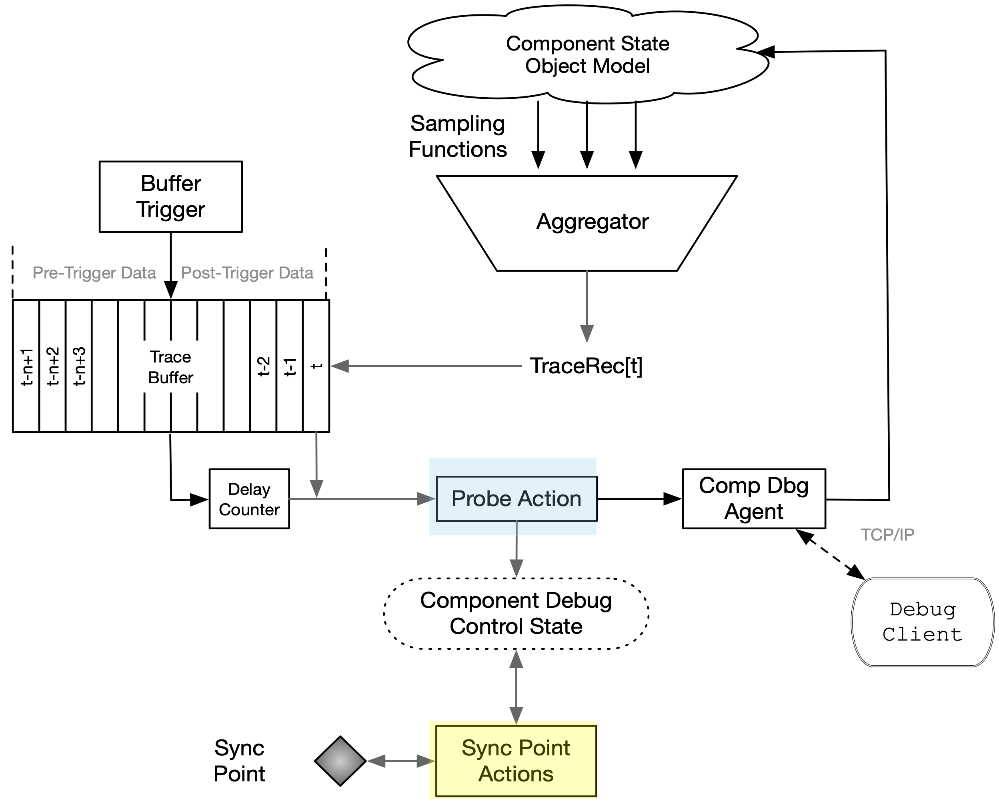
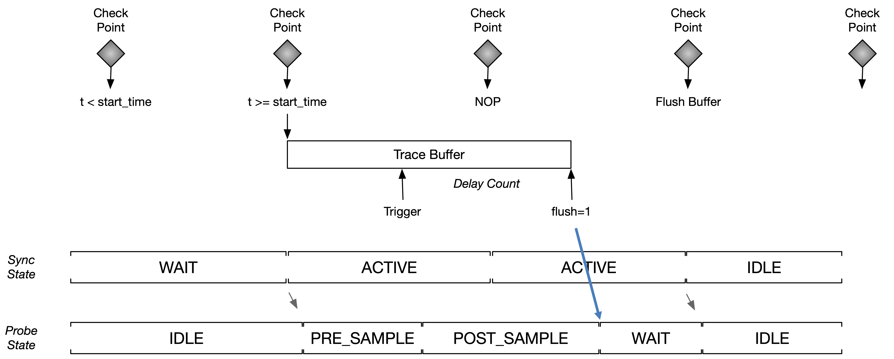
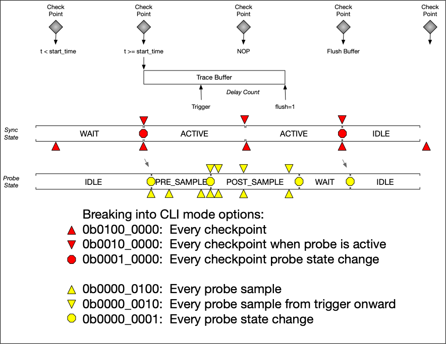
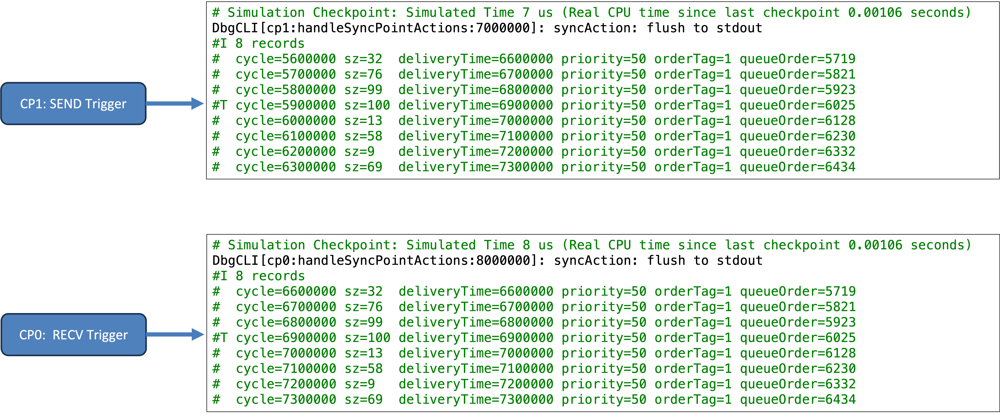
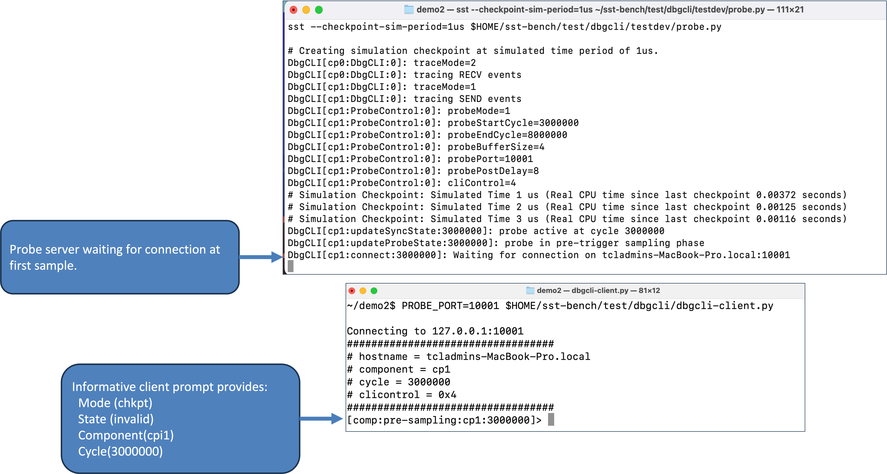
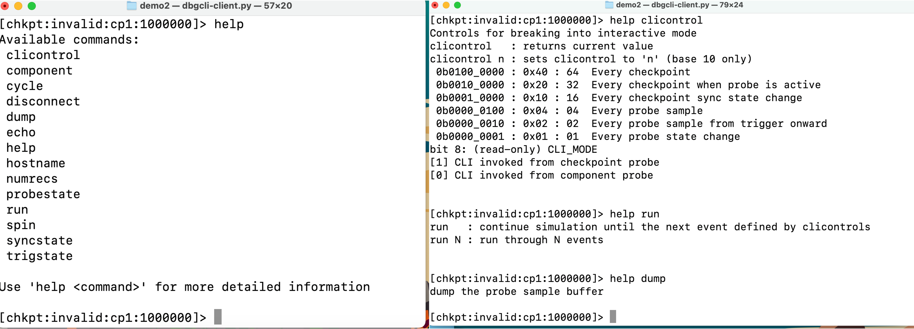
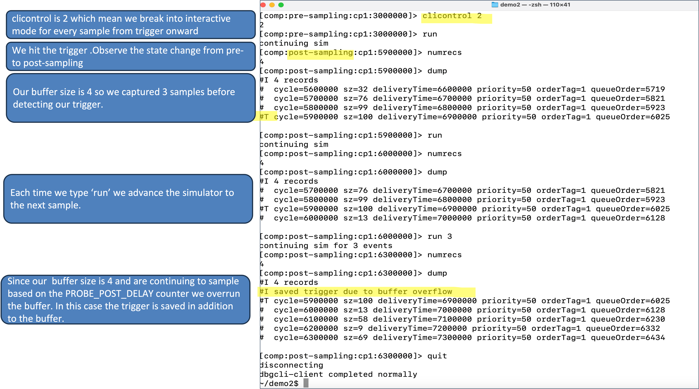
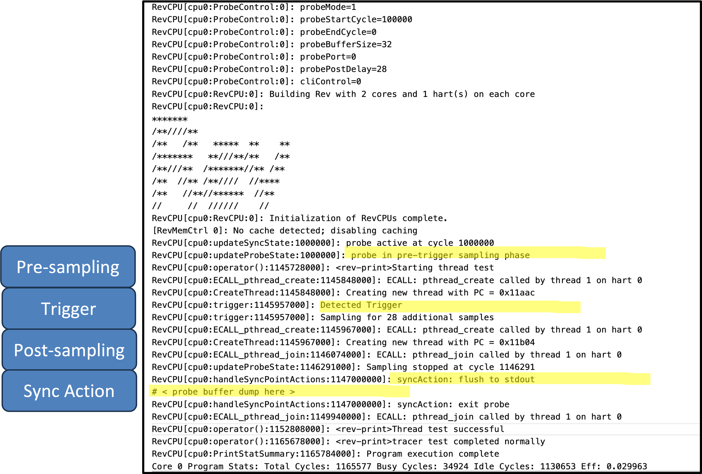

# SST Component Debug Probe

## Overview
**This model is provided for evaluation of the component debug probe concept**

Like highly integrated digital logic devices, large SST simulations represent a vast spatial and temporal state space.  Both digital logic and SST simulations share common debug challenges in observability and controllability in that they require successively narrowing an observation window that includes a failure and intelligently reducing the observable data set to a manageable size.  Additionally, debug greatly benefits from being able to modify internal state at any point in time and resuming operation to observe the effects. 

The motivation for this SST Component Debug Probe follows this analogy and asserts that concepts proven in logic 'design for debug' have application in debugging SST simulations.

## Logic Analyzer Analogy

Consider the constraints presented to a hardware logic analyzer. It cannot directly observe (much less control) all the internal states of a device. Its ability to sample data is limited by its available physical memory. To deal with this it is common practice to design into modern chips features that enable logic analyzers to sample key state as well as minimize the number of samples required to successfully perform debug. 

The following table compares logic analyzer usage and SST Component Debug Probe.

| # | Step | Logic Analyzer Usage<sup>1</sup> | SST Component Debug Probe |
| - | --- | --- | --- |
| 1 | Design for Debug instrumentation | JTAG access to internal scan chains, custom muxes for observing key states at pins | Inclusion of probe.h and follow coding guidelines to access key component states |
| 2 | Connection | Attach cable into a physical socket on a circuit board | Enable using component ELI parameters |
| 3 | Setup | Define sample modes and event triggers | Define sample modes and event triggers
| 4 | Acquire | Capture state and timing information in a circular buffer | Capture state and timing information in a circular buffer
| 5 | Analyze and Display | Vertical (Rows display state as text), Horizontal (waveforms), rich compact traces | Vertical (Rows display state as text), Horizontal (waveforms), rich compact traces

<sup>1</sup> Source:   https://www.tek.com/en/documents/primer/logic-analyzer-fundamentals

## SST Component Debug Probe Architecture



| Concept | Description |
| --- | --- |
| Component State Object Model, Sampling Functions, and Aggregator | This refers to the component instrumentation to sample key variables and combine them into a template based trace record |
| Trace Buffer | A circular memory buffer which captures sampled data |
| Buffer Trigger | An independent event which establishes a marker in the trace buffer to differentiate pre- and post-trigger samples. It also sets a counter to delay disabling data capture |
| Probe Action | A specific behavior such as enabling an interactive client or modifying the event trigger behaviors | 
| Sync Point Actions | Specific behaviors that occur at a state where all threads can share information. In this evaluation model, the synchronization points conveniently occur when a checkpoint is written.|
| Component Debug Agent and Client | Can be a shell or are remote (sockets based) console which allows a user to interact with the model |

## Simple Use Case: One shot capture



## Entering Interactive Probe Console



## Code Instrumentation

See `sst-tools/sstcomp/dbgcli` for a complete example.

1. Include probe header file in component. 
    ```
    // -- Debug Probe
    #include "probe.h"
    ```
2. Extend ProbeControl class which includes a custom type for data capture and a trace buffer
   ```
    // Example of a custom data type for debug samples
    class DbgCLI_Probe final : public ProbeControl {
    public:
        ...
        // custom data type aggregating sample data
        struct event_atts_t {
            uint64_t cycle_ = 0;
            uint64_t sz_ = 0;
            uint64_t deliveryTime_ = 0;
            int priority_ = 0;
            uint64_t orderTag_ = 0; 
            uint64_t queueOrder_ = 0;
            event_atts_t() {};
            event_atts_t(uint64_t c, uint64_t sz, DbgCLIEvent *ev) 
                : cycle_(c), sz_(sz)
            { 
            deliveryTime_ = ev->getDeliveryTime();
            priority_ = ev->getPriority();
            orderTag_ = ev->getOrderTag();
            queueOrder_ = ev->getQueueOrder();
            };
            friend std::ostream & operator<<(std::ostream &os, const event_atts_t& e) {
                os << std::dec << "cycle=" << e.cycle_ 
                << " sz=" << e.sz_ 
                << " deliveryTime=" << e.deliveryTime_ 
                << " priority=" << e.priority_
                << " orderTag=" << e.orderTag_ 
                << " queueOrder=" << e.queueOrder_;
            return os;
        } // struct event_atts_t

        // Custom sampling functions
        void capture_event_atts(uint64_t cycle, uint64_t sz, DbgCLIEvent*ev);

        // trace buffer
        std::shared_ptr<ProbeBuffer<event_atts_t>> probeBuffer;

    }; //class DbgCLI_Probe
   ```
3. Create the debug probe object in the component's constructor

    ```
    // Debug Probe ELI Parameters
    int probeMode       = params.find<int>("probeMode", 0);
    int probeStartCycle = params.find<int>("probeStartCycle",0);
    int probeEndCycle   = params.find<int>("probeEndCycle", 0);
    int probeBufferSize = params.find<int>("probeBufferSize", DEFAULT_PROBE_BUFFER_SIZE);
    int probePort       = params.find<int>("probePort", 0);
    int probePostDelay  = params.find<int>("probePostDelay", 0);
    uint64_t cliControl = params.find<uint64_t>("cliControl", 0);

    // Create Probe
    probe_ = std::make_unique<DbgCLI_Probe>(
            this, &output, probeMode, 
            probeStartCycle, probeEndCycle, probeBufferSize, 
            probePort, probePostDelay, cliControl);

    ```
4. Populate trigger and sampling functions in component

    ```
    /// debug probe 
    if ((traceMode & 2) == 2) {
        uint64_t range = maxData - minData + 1;
        size_t r = cev->getData().size();
        if (probe_->triggering()) {
            probe_->trigger(r > (range-1));
        }
        if (probe_->sampling())
            probe_->capture_event_atts(getCurrentSimCycle(), r, cev);
    }
    ```
5. Advance the probe state in clockTick()
   ```
    /// Debug Probe sequencing
    if (probe_->active()) probe_->updateProbeState(currentCycle);
    ```

## Demos

  ***These demos requires SST v14.1.0 or newer***

### Setup

Build and test `sst-tools`. Also set up a "convenience" environment variable refering to the base directory

    git clone git@github.com:tactcomplabs/sst-tools.git
    cd sst-tools
    export SST_TOOLS_HOME=$PWD
    cd build
    cmake -DSST_TOOLS_ENABLE_TESTING=ON ..
    make && make install
    ctest

For convenience, create an environment vara

### Manual Testing

Run this check manually in order sanity check the debug probe is working properly.

    cd test/dbgcli
    ./run-sanity.bash
    cd testdev
    make

### Demo Source Code

    ./sst-bench/dbgcli
    ├── CMakeLists.txt
    ├── dbgcli.cc 	        # sst demo component
    ├── dbgcli.h
    ├── probe.cc 		     # The generic probe
    └── probe.h
    

    ./test/dbgcli
    ├── dbgcli-client.py     # CLI client for sanity test
    ├── dbgcli-sanity.py     # sst sanity test config
    ├── run-sanity.bash      # sanity test script
    └── testdev
        ├── Makefile         # test makefile
        ├── client-run5.bash # test CLI client 
        ├── logs             # golden test logs
        └── probe.py         # sst probe demo config
  
### Component ELI Parameters

| Parameter | Description |
| --- | --- |
| probeMode | 0:Disabled<br>1:Checkpoint synchronized probing<br>2+:Reserved |
| probeStartCycle | When sync point >= probeStartCycle sampling begins |
| probeBufferSize | Number of records in trace buffer |
| probePort | Starting socket ID for client attach. Components will be assigned ports in ascending order|
| probePostDelay | Delay count to continue sampling after trigger |
| cliControl | Provide coarse to fine-grained controls for when to break into interactive debug mode |

### Demo 1: Multiple Components in Batch Trace

Two components, cp0 and cp1,  send and receive random sized payloads to each other.
- Probe code added to each component
- Triggers on cp1 sending a maximum size packet 
- Triggers on cp0 receiving a maximum size packet. 

Capture ‘one shot’ buffer on each component
- max buffer size is 8 records
- 4 post-trigger records
- Capture checkpoints every 1us and begin sampling at 3us until 8us.

#### Run Demo 1

    mkdir demo1 && cd demo1
    sst --checkpoint-sim-period=1us $SST_TOOLS_HOME/test/dbgcli/testdev/probe.py -- --probeBufferSize=8 --probePostDelay=4 --probeStartCycle=3000000 --probeEndCycle=8000000 --probeC0=1 --probeC1=1

Results:



### Demo 2: Component Debug Probe Interactive Console

Start with same configuration as Demo 1
- Disable cp0 probe
- Max buffer size 4 records
- 8 post-trigger records ( this will cause a buffer over-run condition )
- Capture checkpoints every 1us and begin sampling at 3us until 8us.
- Set CLI_CONTROLS for CP1 to break into interactive debug mode on the first sample.

Once in interactive mode
- View help
- View buffer contents, run a few cycles, repeat….
- Change CLI_CONTROL to break at the trigger event onward
- Run, view, repeat
- disconnect

#### Run Demo 2

    # First launch sst simulation. 
    # This will provide the interactive debug service over port 10100

    sst --checkpoint-sim-period=1us $SST_TOOLS_HOME/test/dbgcli/testdev/probe.py \
    -- --probePort=10100 \
    --probeBufferSize=4 --probePostDelay=8 \
    --probeStartCycle=3000000 --probeEndCycle=8000000 \
    --probeC0=0 --probeC1=1 --cliControlC1=4

    # Next, in a separate xterm open the client for component 1
    # Remember that the SST component was assigned a starting port of 10100.
    # This means that component 1, cp1, will connect over 10101
    # If this port is unavailable the demo will hang. If this occurs,
    # try different port numbers.

    $SST_TOOLS_HOME/test/dbgcli/dbgcli-client.py --probePort=10101

Start-up results:



CLI help results:



CLI interaction results:



### Demo 3: CPU Tracer (Advanced)

This proof-of-concept demonstrates tracing instruction execution for two threads.  
- A REV CPU is configured for 2 cores.
- The probe is triggered when a new thread is spawned.

#### Setup

Build REV CPU 'probe' branch

    git clone https://github.com/tactcomplabs/rev
    cd rev
    export REVHOME=$PWD
    git checkout probe
    cd build
    cmake -DRVCC=riscv64-unknown-elf-gcc ../
    make –j –s && make install

If `spike` is installed it can be used to generate a more readable disassembly trace. This can be enabled using:

```
    cmake -DRVCC=riscv64-unknown-elf-gcc -DREV_USE_SPIKE=1 ../
```

#### Run Demo3

    cd $REVHOME/test/tracer
    ./probe.sh

##### Probe Entry



##### Rich Trace Rendering

